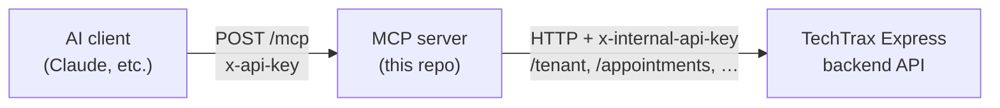

<p align="center">
  
</p>

# TechTrax MCP Server

A [Model Context Protocol](https://modelcontextprotocol.io) server that exposes
TechTrax backend capabilities (tenant info, appointments, statistics, health) as
MCP **tools** to AI clients. Built on [NestJS](https://nestjs.com) +
[`@rekog/mcp-nest`](https://www.npmjs.com/package/@rekog/mcp-nest).



- **Transport:** streamable HTTP only, stateful sessions. Endpoint: `POST /mcp`.
- **Inbound auth:** `x-api-key` header validated against `MCP_CLIENT_API_KEY`
  (required in production).
- **Outbound auth:** every backend call carries `x-internal-api-key`
  (`BACKEND_API_KEY`).
- **Probes:** `GET /healthz` (liveness), `GET /healthz/ready` (readiness — checks
  the backend).

## Quick start (local)

```bash
nvm use            # Node 24 (see .nvmrc)
npm ci
cp .env.example .env   # adjust BACKEND_BASE_URL / BACKEND_API_KEY
npm run start:dev
```

Server logs `…listening on http://0.0.0.0:3100/mcp`. Explore it with the MCP
Inspector:

```bash
npx @modelcontextprotocol/inspector
# connect to http://localhost:3100/mcp (transport: Streamable HTTP)
```

## Configuration

All config is via environment variables, validated at boot
([`src/config/env.validation.ts`](src/config/env.validation.ts)). The process
**refuses to start** on invalid/missing values.

| Variable | Required | Default | Description |
| --- | --- | --- | --- |
| `NODE_ENV` | no | `development` | `development` \| `test` \| `production` |
| `HOST` | no | `0.0.0.0` | Bind address (keep `0.0.0.0` in containers) |
| `PORT` | no | `3100` | HTTP listen port |
| `BACKEND_BASE_URL` | **yes** | — | TechTrax Express base URL |
| `BACKEND_API_KEY` | **yes** | — | Internal secret sent as `x-internal-api-key` |
| `BACKEND_TIMEOUT_MS` | no | `15000` | Outbound request timeout |
| `MCP_SERVER_NAME` | no | `techtrax-mcp` | Server name advertised to clients |
| `MCP_SERVER_VERSION` | no | `1.0.0` | Server version advertised to clients |
| `MCP_CLIENT_API_KEY` | **prod only** | — | Inbound `x-api-key`; required when `NODE_ENV=production` |
| `CORS_ALLOWED_ORIGINS` | no | — | Comma-separated browser origins; empty = CORS off |
| `TRUST_PROXY` | no | `false` | Set `true` behind a proxy/LB/ingress |
| `LOG_LEVEL` | no | `info` | `fatal`…`trace` |

## Authorization

The tenant and the caller's role are both passed by the trusted client (not the AI model):

- **`x-tenant-id`** header — the clinic to act on.
- **`x-actor-role`** — optional trusted role header (`patient`, `doctor`, `receptionist`, `admin`, or `lead_agent`). It takes priority over the `actorRole` tool argument. Production still requires trusted tenant scoping.

```http
x-api-key: <MCP_CLIENT_API_KEY>
x-tenant-id: 6935b6ea...
x-actor-role: receptionist
```

In development, tool arguments remain a compatibility fallback. In production they are not trusted for tenant or role selection. `tools/list` remains unfiltered; capability checks are enforced on every call. See [docs/MCP_TOOL_AUTHORIZATION.md](docs/MCP_TOOL_AUTHORIZATION.md).

Policy lives in [`src/common/mcp/authorization.util.ts`](src/common/mcp/authorization.util.ts) (`ROLE_CAPABILITIES`):

| Capability | Tools | patient | doctor / receptionist / admin |
| --- | --- | :---: | :---: |
| `clinic:read` | `tenant_info.*` (clinic, doctor directory, specialties) | ✅ | ✅ |
| `slots:read` | `appointment.get_available_slots` | ✅ | ✅ |
| `appointment:write` | `appointment.book` / `reschedule` / `cancel` | ✅ | ✅ |
| `patient:read` | `appointment.find_patient` | ❌ | ✅ |
| `appointment:read` | `appointment.list_appointments` / `get_appointment` | ❌ | ✅ |
| `statistics:read` | `statistics.*` | ❌ | ✅ |
| `lead:read` | `crm.list_teams` / `crm.get_team` | ❌ | ✅ |
| `lead:assign` | `crm.assign_lead` | ❌ | ✅ |

The Meta lead workflow reads through `crm.get_conversation_context`, selects routing with `crm.list_teams` and `crm.get_team`, assigns with `crm.assign_lead`, then stores the phone and starts takeover with `meta_leads.qualify_and_handoff`.

Enforcement is **per-call**: a `@RequireCapability(...)` wrapper (in [`tool-authorization.guard.ts`](src/common/mcp/tool-authorization.guard.ts)) wraps each tool handler and checks the call's `actorRole` against the tool's capability. `tools/list` is **NOT** filtered — every tool is always listed — but calling one your role lacks returns an error result (`Not authorized: the '<role>' role cannot perform '<capability>'…`) with the backend never hit. Patients get the self-service set — browse the clinic/doctors/specialties, check slots, and manage their own appointments (book/reschedule/cancel). They cannot search the patient directory, list every appointment in the tenant, or view analytics. Edit `ROLE_CAPABILITIES` in [`authorization.util.ts`](src/common/mcp/authorization.util.ts) (and each tool's `@RequireCapability(...)`) to adjust.

> 🔎 **Discovering role → tool access.** Because `tools/list` is not role-filtered, use the plain HTTP endpoint **`GET /tool-access`** to see the full policy matrix (`{ roles, capabilitiesByRole, tools, toolsByRole, namespaces, toolsByNamespace }`), or **`GET /tool-access?role=lead_agent`** for the Meta lead agent's callable tools grouped by namespace. See [docs/MCP_TOOL_AUTHORIZATION.md](docs/MCP_TOOL_AUTHORIZATION.md).

> ⚠️ **Self-scoping:** `actorRole` identifies the caller as a *patient*, not *which* patient, so the MCP layer cannot enforce "your own record only". A patient-facing client MUST constrain `patientId` (book) and `appointmentId` (reschedule/cancel) to the signed-in patient.

## Scripts

| Command | Purpose |
| --- | --- |
| `npm run start:dev` | Watch mode (pretty logs) |
| `npm run build` | Compile to `dist/` |
| `npm run start:prod` | Run compiled build (`node dist/main`) |
| `npm test` | Unit tests |
| `npm run lint` / `lint:ci` | Lint (autofix / check-only) |

## Tools

Each namespace is a self-contained module under [`src/tools/`](src/tools/):

| Namespace | Example tools |
| --- | --- |
| `health` | `health.ping`, `health.backend` |
| `tenant-info` | tenant lookup |
| `appointment` | appointment queries |
| `statistics` | reporting/statistics |

Adding a namespace = new folder + module + one import line in
[`tools.module.ts`](src/tools/tools.module.ts). No infra changes.

👉 **Adding or extending a tool?** Follow the step-by-step guide with conventions,
a full worked example, and a pre-merge checklist:
**[docs/ADDING_A_TOOL.md](docs/ADDING_A_TOOL.md)**.

👉 **Assigning CRM leads with the AI?** The `crm.*` tools + the three assignment
methods (specific person / team lead / round-robin) are documented in
**[docs/AI-LEAD-ASSIGNMENT.md](docs/AI-LEAD-ASSIGNMENT.md)**.

## Testing

Run the unit suite with `npm test`.

To exercise the server by hand (Postman, curl, or the MCP Inspector), follow
**[docs/MANUAL_TESTING.md](docs/MANUAL_TESTING.md)** — it walks through the session
handshake and passing `tenantId` as a tool argument.

Ready-to-import Postman collection:
**[docs/techtrax-mcp.postman_collection.json](docs/techtrax-mcp.postman_collection.json)**
(auto-captures the MCP session id; set `baseUrl` / `tenantId` in the collection
variables).

Integrating an AI agent runtime with the server? See
**[docs/AI_AGENT_INTEGRATION_GUIDE.md](docs/AI_AGENT_INTEGRATION_GUIDE.md)**.

📌 **Existing integrator?** The tenant is now passed as a **`tenantId` tool
argument** (the `x-tenant-id` header still works). One-page change notice:
**[docs/TENANT_ID_MIGRATION.md](docs/TENANT_ID_MIGRATION.md)**.

## Deployment

See **[DEPLOYMENT.md](DEPLOYMENT.md)** for the DevOps runbook (Docker, compose,
k8s probes, scaling, secrets).
