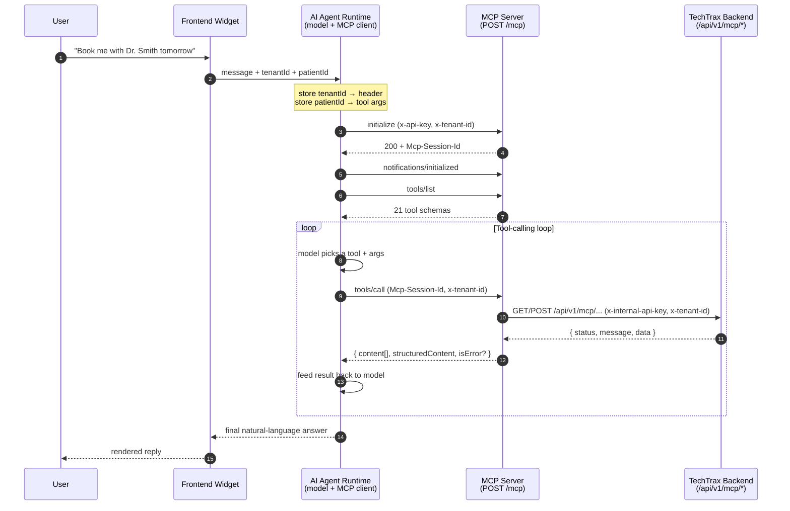
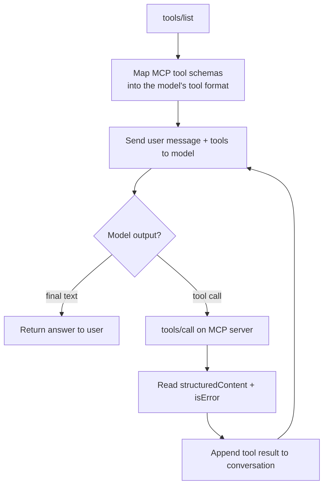
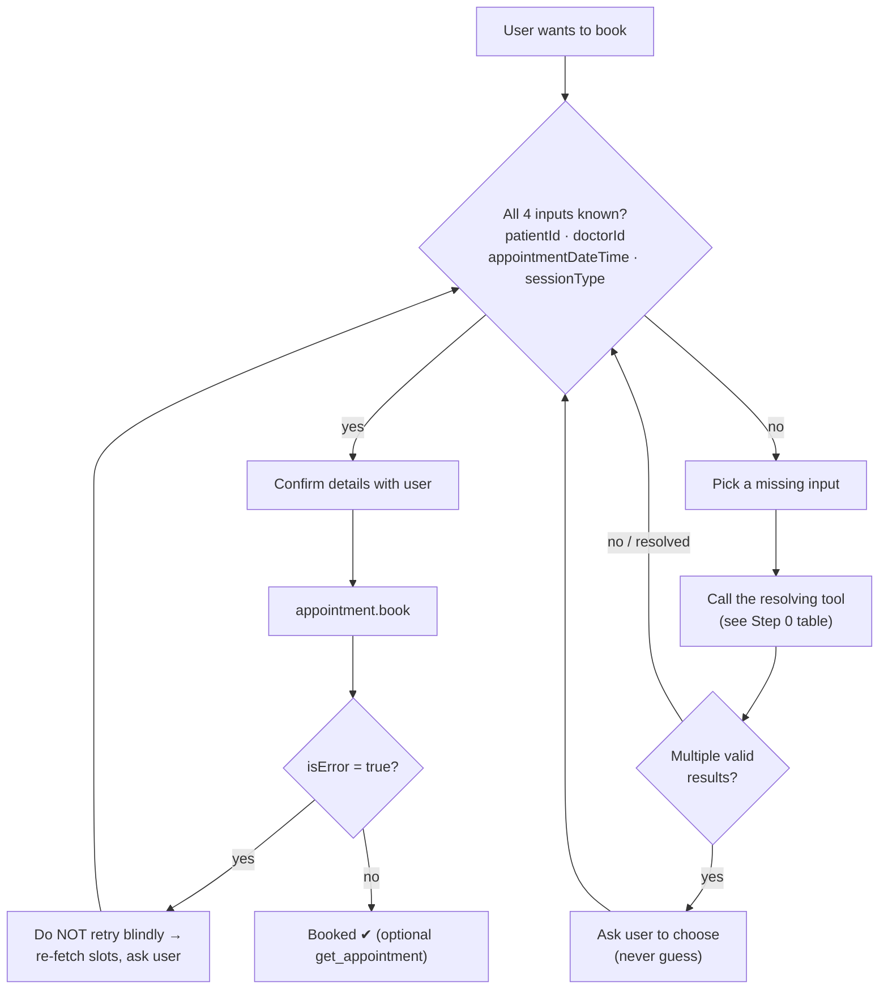
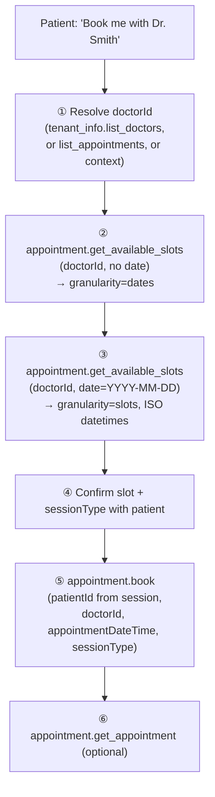
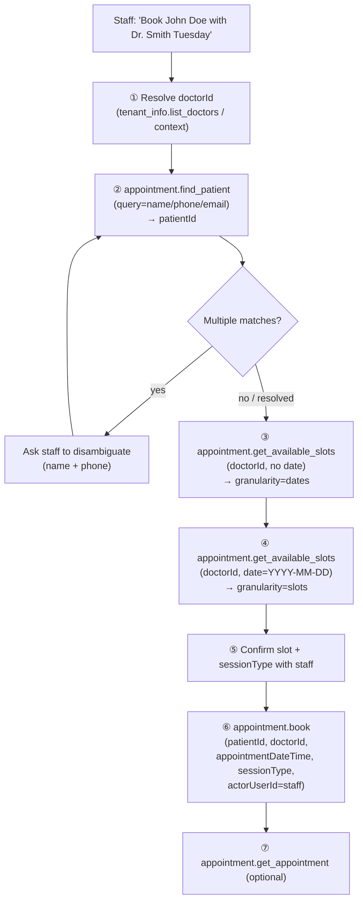

# AI Agent Integration Guide — TechTrax MCP Server

> **Audience:** AI engineers wiring **any** model (OpenAI, Anthropic, Gemini, LangChain, LlamaIndex, a bespoke runtime…) to the TechTrax MCP server.
>
> **Scope:** This is a *model-agnostic* integration guide. The MCP server speaks the [Model Context Protocol](https://modelcontextprotocol.io) over **Streamable HTTP**, so any client that can do JSON-RPC tool calling over HTTP can drive it. There is **no SDK lock-in** — everything below is plain HTTP + JSON-RPC.
>
> **This document changes no runtime behavior.** It documents the server exactly as it ships today.

---

## Table of contents

1. [Architecture overview](#1-architecture-overview)
2. [The startup flow (frontend → agent)](#2-the-startup-flow-frontend--agent)
3. [The first call (initialize handshake)](#3-the-first-call-initialize-handshake)
4. [Connecting any AI model](#4-connecting-any-ai-model)
5. [`tenant_info` namespace guide](#5-tenant_info-namespace-guide)
6. [Booking an appointment (tool chain)](#6-booking-an-appointment-tool-chain)
   - [6.1 Patient self-booking (known `patientId`)](#61-patient-self-booking-known-patientid)
   - [6.2 Staff booking — receptionist / admin (unknown `patientId`)](#62-staff-booking--receptionist--admin-unknown-patientid)
7. [Statistics tools guide](#7-statistics-tools-guide)
8. [Reference / cheat sheet](#8-reference--cheat-sheet)

---

## 1. Architecture overview

The TechTrax MCP server is a thin, stateless-per-tool **gateway** that exposes the TechTrax clinic backend to AI agents as a catalog of typed tools. It does no business logic of its own — every tool resolves a tenant, makes exactly one authenticated call to the Express backend, and shapes the result into an MCP tool response.

### The four roles

| Role | What it is | Responsibility |
|------|-----------|----------------|
| **Frontend widget** | The `ChatbotWidget` in the TechTrax React app (`src/shared/components/ui/ChatbotWidget`) | Knows the logged-in **patient** and the active **tenant**. Sends the user's message + that context to the agent runtime. |
| **AI Agent runtime** | Your service: an LLM **+** an MCP client | Holds the conversation, lists tools, lets the model pick a tool, issues `tools/call`, feeds results back. Owns the `x-tenant-id` header and the `patientId` tool argument. |
| **MCP server** | This repo (`techtrax-mcp`, NestJS + `@rekog/mcp-nest`) | Exposes 21 tools across 4 namespaces over `POST /mcp`. Validates inbound auth, resolves tenant, proxies to the backend. |
| **TechTrax backend** | The Express + MongoDB API (`techtrax-backend`) | The source of truth. Exposes `/api/v1/mcp/*` endpoints the MCP server calls. |

### Request path



### The single most important rule: header vs. argument

This trips up every new integrator. Internalize it now:

| Identity | How it travels | Why |
|----------|----------------|-----|
| **Tenant** (which clinic) | **HTTP header** `x-tenant-id` (a Mongo ObjectId) | It is request/session context, not data the model reasons about. The model should never see, choose, or hallucinate it. The MCP server reads it from the request and forwards it to the backend. |
| **Patient** (which person) | **Tool argument** `patientId` (a string) | It *is* data the model reasons about: it must look it up (`appointment.find_patient`), confirm it, and pass it explicitly into write tools like `appointment.book`. |

> **Never** put `patientId` in a header. **Never** put `tenantId` in a tool argument. The server's tenant resolver (`resolveTenantId`) only ever reads tenant from `request.user.*` or the `x-tenant-id` header — it will not look at tool args.

---

## 2. The startup flow (frontend → agent)

Before a single MCP call happens, the agent runtime needs two pieces of context from the frontend: the **tenantId** (for the header) and the **patientId** (for tool args).

### Where the frontend gets each value

| Value | Source in the React app | Notes |
|-------|--------------------------|-------|
| `tenantId` | `tenantService.getTenant()` → `_id` | The Mongo ObjectId of the active clinic/tenant. This becomes the `x-tenant-id` header. |
| `patientId` | The current patient context (route param / `usePatientId()`) | The Mongo ObjectId of the signed-in patient. This becomes the `patientId` **argument** on booking tools. |
| `message` | The text the user typed in the widget | The natural-language turn fed to the model. |

### What the agent does with them

```text
on receive { message, tenantId, patientId }:
    session.tenantId  = tenantId      # → x-tenant-id header on every /mcp request
    session.patientId = patientId     # → patientId argument on booking tools
    append message to conversation
    run tool-calling loop  (sections 3–4)
```

- `tenantId` is **pinned for the whole MCP session** (see §3 — handlers bind to the session's first request).
- `patientId` is kept in agent memory and injected into tool args when (and only when) a tool needs it. **Patient self-booking (§6.1)** uses this value directly and skips `find_patient`. **Staff booking (§6.2)** does not receive a `patientId` — the agent must resolve one via `appointment.find_patient` first.

---

## 3. The first call (initialize handshake)

The transport is **Streamable HTTP in stateful mode**. There is exactly one endpoint:

```
POST http://<host>:<port>/mcp        # default: http://0.0.0.0:3100/mcp
```

Key transport facts (from `app.module.ts`):

- `transport: [STREAMABLE_HTTP]` — STDIO and SSE transports are **disabled**.
- `enableJsonResponse: false` — responses come back as an **SSE stream** (`Content-Type: text/event-stream`), even though you POST a single JSON-RPC request. Your client must read the streamed `data:` event(s).
- `statelessMode: false` + `sessionIdGenerator: randomUUID()` — the server issues a **session id** on `initialize` and expects it on every subsequent call.

### Required headers

| Header | Value | When | Notes |
|--------|-------|------|-------|
| `content-type` | `application/json` | every request | You POST JSON-RPC. |
| `accept` | `application/json, text/event-stream` | every request | The transport streams responses; advertise both. |
| `x-api-key` | your MCP client key | every request | Validated by `McpClientGuard` against `MCP_CLIENT_API_KEY`. **No-op when the key is unset** (local/dev); **required in production** (env validation enforces it). |
| `x-tenant-id` | tenant Mongo ObjectId | **must be present on `initialize`** | Handlers bind tenant from the session's first request. Send it on every request anyway — it's cheap and explicit. |
| `mcp-session-id` | the id returned by `initialize` | every request **after** `initialize` | Omit on `initialize` (the server mints it). Required on everything afterward. |

### Step 1 — `initialize`

Send the JSON-RPC `initialize` request. Note the headers — **`x-tenant-id` is on this very first POST**.

```bash
curl -i -X POST http://localhost:3100/mcp \
  -H 'content-type: application/json' \
  -H 'accept: application/json, text/event-stream' \
  -H 'x-api-key: YOUR_MCP_CLIENT_KEY' \
  -H 'x-tenant-id: 6650f1a2b3c4d5e6f7a8b9c0' \
  -d '{
    "jsonrpc": "2.0",
    "id": 1,
    "method": "initialize",
    "params": {
      "protocolVersion": "2025-06-18",
      "capabilities": {},
      "clientInfo": { "name": "my-agent", "version": "1.0.0" }
    }
  }'
```

The response is an SSE stream. Two things matter:

1. The HTTP response header **`Mcp-Session-Id: <uuid>`** — capture it.
2. The JSON-RPC result body advertising server capabilities.

```
HTTP/1.1 200 OK
content-type: text/event-stream
mcp-session-id: 2f9c1e7a-...-a1b2c3

data: {"jsonrpc":"2.0","id":1,"result":{"protocolVersion":"2025-06-18","capabilities":{"tools":{}},"serverInfo":{"name":"techtrax-mcp","version":"1.0.0"}}}
```

### Step 2 — `notifications/initialized`

Acknowledge the handshake. This is a JSON-RPC **notification** (no `id`, no response body). Include the session id now.

```bash
curl -i -X POST http://localhost:3100/mcp \
  -H 'content-type: application/json' \
  -H 'accept: application/json, text/event-stream' \
  -H 'x-api-key: YOUR_MCP_CLIENT_KEY' \
  -H 'x-tenant-id: 6650f1a2b3c4d5e6f7a8b9c0' \
  -H 'mcp-session-id: 2f9c1e7a-...-a1b2c3' \
  -d '{ "jsonrpc": "2.0", "method": "notifications/initialized" }'
```

### Step 3 — `tools/list`

Now discover the catalog. This returns all 21 tools with their JSON-Schema `inputSchema` and `outputSchema`.

```bash
curl -i -X POST http://localhost:3100/mcp \
  -H 'content-type: application/json' \
  -H 'accept: application/json, text/event-stream' \
  -H 'x-api-key: YOUR_MCP_CLIENT_KEY' \
  -H 'x-tenant-id: 6650f1a2b3c4d5e6f7a8b9c0' \
  -H 'mcp-session-id: 2f9c1e7a-...-a1b2c3' \
  -d '{ "jsonrpc": "2.0", "id": 2, "method": "tools/list" }'
```

### Stateful-session rules

| Situation | What to send | Server behavior |
|-----------|--------------|-----------------|
| **New session** | `initialize` **without** `mcp-session-id` | Mints a new id, returns it in the `Mcp-Session-Id` response header. |
| **Continue a session** | any method **with** the valid `mcp-session-id` | Reuses the existing session and its bound tenant context. |
| **Invalid / unknown / expired session** | a `mcp-session-id` the server doesn't recognize | Request is rejected (HTTP 4xx / JSON-RPC error). **Re-run `initialize`** to get a fresh session, then retry. |
| **Server restarted** | an id from before the restart | Sessions are in-memory; they don't survive restarts. Treat as "invalid session" → re-`initialize`. |

### Model-agnostic MCP-client pseudocode

```python
class TechTraxMcp:
    def __init__(self, base_url, api_key, tenant_id):
        self.base_url = base_url            # http://host:3100/mcp
        self.api_key = api_key              # MCP_CLIENT_API_KEY
        self.tenant_id = tenant_id          # the clinic's ObjectId
        self.session_id = None

    def _headers(self):
        h = {
            "content-type": "application/json",
            "accept": "application/json, text/event-stream",
            "x-api-key": self.api_key,
            "x-tenant-id": self.tenant_id,
        }
        if self.session_id:
            h["mcp-session-id"] = self.session_id
        return h

    def _post(self, body):
        resp = http_post(self.base_url, headers=self._headers(), json=body)
        # Capture the session id on the initialize response.
        if "mcp-session-id" in resp.headers:
            self.session_id = resp.headers["mcp-session-id"]
        return parse_sse(resp.body)        # read the streamed data: event(s)

    def connect(self):
        self._post({"jsonrpc": "2.0", "id": 1, "method": "initialize",
                    "params": {"protocolVersion": "2025-06-18",
                               "capabilities": {},
                               "clientInfo": {"name": "agent", "version": "1.0.0"}}})
        self._post({"jsonrpc": "2.0", "method": "notifications/initialized"})

    def list_tools(self):
        return self._post({"jsonrpc": "2.0", "id": 2, "method": "tools/list"})

    def call_tool(self, name, args):
        return self._post({"jsonrpc": "2.0", "id": next_id(), "method": "tools/call",
                           "params": {"name": name, "arguments": args}})
```

> Many languages have a ready-made MCP client (e.g. the official MCP SDKs) that handles the SSE parsing, session id, and handshake for you. The pseudocode above is what they do under the hood.

---

## 4. Connecting any AI model

MCP tool calling and LLM "function calling" are the same idea in two dialects. The agent's job is to translate between them.

### The loop



### Step 1 — Map MCP tools into the model's tool format

Each MCP tool from `tools/list` has `name`, `description`, and `inputSchema` (JSON Schema). Every major model accepts exactly those three.

| MCP field | OpenAI (`tools[].function`) | Anthropic (`tools[]`) | Gemini (`functionDeclarations[]`) |
|-----------|------------------------------|------------------------|------------------------------------|
| `name` | `name` | `name` | `name` |
| `description` | `description` | `description` | `description` |
| `inputSchema` | `parameters` | `input_schema` | `parameters` |

> ⚠️ **Tool name dots.** Tool names use a `namespace.tool` dotted form (e.g. `appointment.book`). OpenAI's function-name pattern historically disallows `.`. If your provider rejects dotted names, sanitize for the model (`appointment.book` → `appointment__book`) and reverse the mapping before issuing `tools/call`. Keep a `{model_name → mcp_name}` lookup.

### Step 2 — Issue `tools/call` when the model picks a tool

When the model emits a tool call, forward it verbatim (after un-sanitizing the name):

```json
{
  "jsonrpc": "2.0",
  "id": 7,
  "method": "tools/call",
  "params": {
    "name": "tenant_info.list_doctors",
    "arguments": { "specialty": "Cardiology", "format": "json" }
  }
}
```

### Step 3 — Feed the result back

Every tool returns the same envelope:

```json
{
  "content": [{ "type": "text", "text": "<json-or-markdown>" }],
  "structuredContent": { /* typed object matching the tool's outputSchema */ },
  "isError": false
}
```

- **`structuredContent`** — the typed object. **Always prefer this** for programmatic logic (it matches the tool's advertised `outputSchema`). It is present on *both* `format: json` and `format: markdown` responses.
- **`content[0].text`** — a string rendering. With `format: 'json'` (the default) it's pretty-printed JSON; with `format: 'markdown'` it's a human-readable markdown summary. Feed this back to the model as the tool result.
- **`isError`** — when `true`, the `text` holds a human-readable error message (e.g. *"Doctor not found. Use tenant_info.list_doctors…"*). The model should read it and adapt, not crash.

### The `format` argument

**Every** tool accepts an optional `format: 'json' | 'markdown'` argument (default `'json'`).

- Use `format: 'markdown'` when you want the model to summarize for a human and want fewer tokens / cleaner prose.
- Use `format: 'json'` (default) when your code parses the result. Either way `structuredContent` is available, so this is mostly a token/readability choice for the `text` block.

### Error handling rules

- Tools **do not throw** to the protocol layer for expected conditions. A missing tenant, a not-found doctor, or a backend validation failure comes back as `isError: true` with an actionable message — handle it in the loop.
- **Empty arrays are success, not error.** `find_patient` with no matches, `list_doctors` with no results, `get_available_slots` with no openings all return `isError: false` with an empty collection. Don't retry these as if they failed.
- **Idempotency matters for retries.** Read tools (`readOnlyHint: true, idempotentHint: true`) are safe to auto-retry. **Write tools are not** — see §6.

---

## 5. `tenant_info` namespace guide

Four read-only tools answer "questions about the clinic and its doctors." All are idempotent and safe to retry. All accept the optional `format` arg.

| Tool | Use it for | Required args | Optional args |
|------|-----------|---------------|---------------|
| `tenant_info.get_clinic_profile` | Anything about the **clinic itself**: name, contact, address, specialties, hours, "are you open right now?" | — | `format` |
| `tenant_info.list_doctors` | "**Which doctors**" questions — directory, by name, by specialty, by online/offline support, by presence | — | `name`, `specialty`, `supportsOnline`, `supportsOffline`, `presenceStatus`, `page`, `limit`, `format` |
| `tenant_info.get_doctor_profile` | One doctor's **static credentials**: bio, education, certifications, experience | `doctorId` | `format` |
| `tenant_info.get_doctor_availability` | "Is Dr. X available **today** / when do they work / online or clinic day?" | `doctorId` | `format` |

### `tenant_info.get_clinic_profile`

Returns clinic identity + operating info + a **live `currentStatus`**:

- `currentStatus` ∈ `open_now` (within today's hours) · `closed_now` (a working day, but outside hours) · `closed_today` (not a working day).
- Other fields: `name`, `description`, `logoUrl`, `primaryPhone`, `secondaryPhone`, `email`, `address`, `specialties[]`, `timezone`, `operatingHours[]` (`{ day, openTime, closeTime, isWorkingDay }`).

Use this for location/contact/services/hours/"open now?" — **not** doctor-specific questions.

### `tenant_info.list_doctors`

Per doctor: `id`, `fullName`, `specialty`, `bio`, `presenceStatus` (`present` = clocked in today / accepting, `absent` = not), `supportsOnline`, `supportsOffline`.

**Pagination (note the snake_case here):** read `pagination.has_more`; to advance, pass `pagination.next_page` as the next call's `page`. When `has_more` is `false`, you're on the last page.

> ⚠️ This namespace's pagination uses **snake_case** (`has_more`, `next_page`, `total_count`). The `appointment` namespace uses **camelCase** (`hasMore`, `nextPage`, `total`). Don't mix them up.

### `tenant_info.get_doctor_profile`

`doctorId` required. Returns **static** profile only: `firstName`, `lastName`, `email`, `phone`, `specialty`, `bio`, `education` (`university`, `faculty`, `major`, `graduationYear`, `degree`, `level`), `certifications[]` (`certificationName`, `year`), and `experience` (one of `0-2`, `3-5`, `6-8`, `9-10`, `10+`). **No schedule** — use the availability tool for that. A bad id returns an actionable "Doctor not found" error.

### `tenant_info.get_doctor_availability`

`doctorId` required. Returns:

- `available` (bool) — can be booked **today**.
- `reason` — `absent` (not clocked in) · `no_shift_today` (no shift for today's weekday) · `null` when available.
- `availableOnline` / `availableOffline` — consultation modes the doctor supports overall.
- `schedule[]` — `{ day, startTime, endTime, mode }`, `mode` ∈ `online` · `offline` · `both`.

> **Availability is advisory, not bookable slots.** This reflects *schedule + presence only*. It does **not** count appointment slots and cannot confirm an exact bookable time. For real bookable times, always use `appointment.get_available_slots` (§6) — the booking flow is the source of truth.

---

## 6. Booking an appointment (tool chain)

Booking usually requires multiple tool calls depending on what information is already known. It is **not** a fixed linear chain. The `appointment.*` namespace gives you the building blocks; the agent's job is to **resolve whatever is missing** and then write — not to replay a hardcoded sequence.

Treat booking as *dynamic tool selection*, not a script. Two agents booking the same appointment may legitimately make different calls because they start with different known information: one already has a `doctorId` from a prior turn, another must look the doctor up; one knows the patient, another must search for them.

> **Golden rule:** never invent or reformat a datetime. Take a slot string from `appointment.get_available_slots` and pass it byte-for-byte into `book` / `reschedule`. The backend re-validates against the doctor's shift, work-mode, leave, and existing appointments and **rejects overlaps**.

> **Do not use `tenant_info.get_doctor_availability` to pick a bookable time.** It is advisory (schedule + presence only). Only `appointment.get_available_slots` returns slots the backend will accept on `book`.

---

### Step 0 — Booking context resolution

Before doing anything, determine whether you already have enough information to book. `appointment.book` needs exactly **four** inputs:

| Required booking input | What it is |
|------------------------|-----------|
| `patientId` | Who the appointment is for (Mongo ObjectId). |
| `doctorId` | Which doctor (Mongo ObjectId). |
| `appointmentDateTime` | An exact ISO slot **taken verbatim** from `get_available_slots`. |
| `sessionType` | `online` \| `on-site`. |

Inventory which of these you already hold (from session context, the frontend, or earlier turns), then resolve **only the missing ones** with the matching tool:

| Missing Information | Tool |
|---------------------|------|
| Unknown patient | `appointment.find_patient` |
| Unknown doctor | `tenant_info.list_doctors` |
| Previous doctor lookup ("the doctor I saw last time") | `appointment.list_appointments` |
| Unknown date | `appointment.get_available_slots` (without `date`) |
| Unknown exact slot | `appointment.get_available_slots` (with `date`) |

If all four inputs are already known and trusted (e.g. resolved earlier in the conversation), you may call `appointment.book` directly — no preparatory calls are required.

#### `doctorId` does not have to start with `list_doctors`

A common misconception is that doctor resolution always begins with `tenant_info.list_doctors`. It does not. `doctorId` can legitimately come from any of:

- **`tenant_info.list_doctors`** — when the user names a doctor or specialty you must look up.
- **`appointment.list_appointments`** — when the user references a prior appointment ("the same doctor I visited last time"); read `doctorId` off the returned appointment.
- **Previous conversation state** — a `doctorId` already resolved earlier in this session.
- **Known application context** — e.g. the UI opened the chat from a specific doctor's page and forwarded the id.

Pick the cheapest source that yields a trustworthy id. Only fall back to `list_doctors` when you genuinely need to discover or disambiguate a doctor.

---

### Tool selection principle

Do **not** follow a hardcoded booking flow. Drive the conversation from missing information instead:

1. **Detect** which of the four booking parameters are missing.
2. **Resolve** each missing parameter with the tool that produces it (see the Step 0 tables).
3. **Clarify** with the user whenever a resolution tool returns more than one valid option — never guess.
4. **Confirm** the final booking details (doctor, slot, `sessionType`, and who it's for) with the user.
5. **Execute** `appointment.book` once, with all four inputs satisfied.



This loop subsumes every "flow" below: the patient and staff examples are just two starting points on the same decision graph.

---

### Ambiguity handling (never guess)

Several resolution tools can return **more than one** valid candidate. When they do, the agent must **stop and ask the user to choose** before continuing — picking the first result is a correctness bug, not a shortcut.

| Tool | Ambiguous when | What to do |
|------|----------------|------------|
| `tenant_info.list_doctors` | A specialty or partial name matches **multiple doctors** (e.g. *"I need a dermatologist"*). | Present the candidates (`fullName`, `specialty`, presence) and let the user pick one `doctorId`. |
| `appointment.find_patient` | A name/phone/email matches **multiple patients**. | Present the matches (`fullName`, `phone`, `email`) and let the user pick one `id`. |
| `appointment.list_appointments` | The user references "my last visit" but there are **several past appointments / doctors**. | Confirm which appointment/doctor they mean before reusing its `doctorId`. |
| `appointment.get_available_slots` | Several slots fit a vague time ("sometime Tuesday morning"). | Offer the concrete returned slots and let the user pick the exact ISO value. |

Rules:

- **Zero results** is a valid answer, not an error — tell the user nothing matched and ask for more detail (don't proceed to `book`).
- **One result** can be used directly (still confirm before the write).
- **Two or more results** always require user selection. Never auto-select.

---

### Booking failure recovery

`appointment.book` is a **non-idempotent write**. If it returns `isError: true` (e.g. the slot was taken between fetch and book, or it conflicts with the doctor's shift/leave):

1. **Do not retry the same call automatically** — a blind retry can create a duplicate or repeat the same rejected request.
2. **Re-fetch availability** with `appointment.get_available_slots` (with `date`) to get the current, still-bookable slots.
3. **Ask the user to choose another slot** from the refreshed list, then confirm and call `book` again with the new `appointmentDateTime`.

The same recovery applies to `appointment.reschedule`. Read the `isError` message — the backend returns an actionable reason (conflict, past time, doctor unavailable) you should surface to the user.

---

The two subsections below are **canonical examples**, not mandatory flows. They show the most common starting points; the underlying logic is always the decision loop above.

### 6.1 Patient self-booking (known `patientId`)

**A typical booking scenario:** the patient is logged into the app and the agent runtime already received `patientId` from the frontend (§2). Because the patient is booking **for themselves**, `patientId` is already satisfied — so `appointment.find_patient` is usually unnecessary.

#### Known vs. missing at the start

| Field | Source | Status |
|-------|--------|--------|
| `tenantId` | Frontend → agent | Known (becomes `x-tenant-id` header) |
| `patientId` | Frontend → agent (`usePatientId()` / route context) | **Known** — no `find_patient` needed |
| `doctorId` | Resolve as needed | Usually missing |
| `appointmentDateTime` | Resolve via `get_available_slots` | Missing |
| `sessionType` | Ask the user | Missing |

#### One common booking path



#### Step-by-step — what, why, skip?

| Step | Tool | Why this step exists | Skip when |
|------|------|----------------------|-----------|
| ① | Resolve `doctorId` (`tenant_info.list_doctors`, `appointment.list_appointments`, or known context) | `book` requires a doctor **id**, not a name. The source depends on how the user referred to the doctor (see Step 0). | `doctorId` is already known from context or a prior turn. |
| ② | `appointment.get_available_slots` (no `date`) | Lists **which calendar days** have openings (~next two months). | User already named a specific date — go straight to step ③ with that date. |
| ③ | `appointment.get_available_slots` (with `date`) | Returns **exact bookable ISO datetimes** for that day, excluding booked/past slots. The only source of valid `appointmentDateTime` values. | Never skip before `book`. |
| ④ | *(agent logic, not a tool)* | Patient must confirm the slot and `sessionType` (`online` \| `on-site`). Write tools are not idempotent. | Never skip. |
| ⑤ | `appointment.book` | Creates the appointment. `patientId` comes from **session context**, not from `find_patient`. | — |
| ⑥ | `appointment.get_appointment` | Optional verification / confirmation message to the patient. | Safe to skip if `book` returned the full appointment. |

#### Variation: "book me with the same doctor I saw last time"

Here doctor resolution starts from history, not the directory:

```json
// ① Find the prior appointment for this patient → read its doctorId
{ "name": "appointment.list_appointments", "arguments": { "patientId": "6650a1b2c3d4e5f6a7b8c9d0", "limit": 5 } }
// → structuredContent.appointments[0].doctorId = "6640f1a2b3c4d5e6f7a8b9c1"
```

Then continue with `get_available_slots` → confirm → `book` exactly as above. If the patient has several past doctors, **ask which one** before reusing an id.

#### Example `book` call (patient scenario)

```json
{
  "name": "appointment.book",
  "arguments": {
    "patientId": "6650a1b2c3d4e5f6a7b8c9d0",
    "doctorId": "6640f1a2b3c4d5e6f7a8b9c1",
    "appointmentDateTime": "2026-07-01T10:00:00.000Z",
    "sessionType": "online"
  }
}
```

`patientId` is injected by the agent from session context — the model should **not** be asked to discover or guess it.

#### Tools usually unnecessary here

| Tool | Why it's typically skipped |
|------|----------------------------|
| `appointment.find_patient` | Patient is already identified via session context. Calling it adds latency and risks matching the wrong person. |
| `tenant_info.get_doctor_availability` | Advisory only — does not return bookable slots. Use only if the patient asks "does Dr. Smith work on Tuesdays?" before booking. |

---

### 6.2 Staff booking — receptionist / admin (unknown `patientId`)

**A typical booking scenario:** a clinic staff member (receptionist, nurse, admin) uses the AI to book **on behalf of** a patient. The agent has `tenantId` (and usually `actorUserId` for the staff member) but **does not** yet have the patient's `patientId` — so resolving the patient with `appointment.find_patient` is the distinguishing step.

#### Known vs. missing at the start

| Field | Source | Status |
|-------|--------|--------|
| `tenantId` | Frontend / staff session | Known (`x-tenant-id` header) |
| `actorUserId` | Staff user's id | Known — pass on `book` for audit (who booked) |
| `patientId` | Resolve via `find_patient` | **Missing** — must be resolved before `book` |
| `doctorId` | Resolve as needed | Usually missing |
| `appointmentDateTime` | Resolve via `get_available_slots` | Missing |
| `sessionType` | Ask the user | Missing |

#### One common booking path



#### Step-by-step — what, why, skip?

| Step | Tool | Why this step exists | Skip when |
|------|------|----------------------|-----------|
| ① | Resolve `doctorId` (`tenant_info.list_doctors` or known context) | Resolve doctor name/specialty → `doctorId`. | `doctorId` already known from context. |
| ② | `appointment.find_patient` | Staff speak in **names and phone numbers**, but `book` requires a `patientId`. This is the **only** tool that maps free-text identity → id. **This step is what distinguishes the staff scenario.** | You already hold a trusted `patientId` for this person. |
| ②b | *(agent logic)* | If `find_patient` returns **multiple** matches, ask the staff member to pick (show `fullName` + `phone`). If **zero** matches, stop — do not call `book`. | — |
| ③ | `appointment.get_available_slots` (no `date`) | List bookable days. | Staff already named a date. |
| ④ | `appointment.get_available_slots` (with `date`) | Exact ISO slots. | Never skip before `book`. |
| ⑤ | *(agent logic)* | Staff must confirm slot and `sessionType` before a non-idempotent write. | Never skip. |
| ⑥ | `appointment.book` | Creates the appointment for the **resolved** `patientId`, attributed to the staff member via `actorUserId`. | — |
| ⑦ | `appointment.get_appointment` | Optional confirmation back to staff. | Safe to skip. |

#### Example `find_patient` → `book` sequence

```json
// Step ② — staff said "John Doe" or "01001234567"
{ "name": "appointment.find_patient", "arguments": { "query": "John Doe" } }
// → structuredContent.patients[0].id = "6650a1b2c3d4e5f6a7b8c9d0"

// Step ⑥ — after slot confirmation
{
  "name": "appointment.book",
  "arguments": {
    "patientId": "6650a1b2c3d4e5f6a7b8c9d0",
    "doctorId": "6640f1a2b3c4d5e6f7a8b9c1",
    "appointmentDateTime": "2026-07-01T10:00:00.000Z",
    "sessionType": "on-site",
    "actorUserId": "6630e1f2a3b4c5d6e7f8a9b0"
  }
}
```

#### Staff-scenario edge cases

| Situation | What to do |
|-----------|------------|
| `find_patient` returns **0** patients | Tell staff no match; do **not** call `book`. Ask for a different spelling, phone, or email. |
| `find_patient` returns **2+** patients | Present the list (`fullName`, `phone`, `email`); let staff pick one `id`. Never guess. |
| Staff says *"book for the patient on the phone"* with no identifier | Ask for at least one of: full name, phone, or email before calling `find_patient`. |
| Staff is booking for **themselves** as a patient | Unusual but valid — still resolve a `patientId` unless you already have one in context. |

---

### Choosing a starting point (guidance, not a rule)

The two scenarios above differ mainly in **how `patientId` is obtained**. Use this as a heuristic for where to start — then let the Step 0 inventory and the decision loop take over:

```text
if patientId is already known (patient self-booking):
    start from §6.1 — usually skip find_patient
else if the user is booking for someone else (staff):
    start from §6.2 — resolve patientId via find_patient first
# in all cases: only call the tools needed to fill missing inputs,
# ask the user whenever a tool returns multiple candidates,
# and confirm before appointment.book.
```

Your agent runtime should derive the starting point from **auth context** (role + whether `patientId` was forwarded), not from the model guessing.

> ### ⚠️ The MCP server is **not** responsible for choosing or enforcing the flow
>
> Selecting the booking path and resolving the inputs is a **rule your agent runtime implements**, not something the MCP server does. The server has **no concept of "patient" vs "receptionist"** — it does not see the user's JWT, does not know the caller's role, and does not gate tools by role.
>
> What the MCP server *actually* does:
> - Resolves the **tenant** from `x-tenant-id` (or `request.user`) and forwards it to the backend.
> - Exposes the **same 21 tools to every caller** — `find_patient`, `book`, etc. are all callable regardless of who is asking.
> - Validates **inbound auth** (`x-api-key`) and **tool argument shapes** (Zod) — nothing more.
>
> Therefore, these are **the agent runtime's job, not the server's**:
> - Detecting the user's role (patient vs staff) from your own auth context.
> - Deciding which booking inputs are missing and which tools to call.
> - Supplying the correct `patientId` and `actorUserId`.
> - Preventing a patient from booking for someone else (the server will happily accept any valid `patientId` you send).
>
> | Concern | Owned by |
> |---------|----------|
> | Who is the user / what role | **Agent runtime** |
> | Pick the booking path & which tools to call | **Agent runtime** |
> | Resolve & inject `patientId` / `actorUserId` | **Agent runtime** |
> | Tenant scoping (`x-tenant-id` → backend) | MCP server |
> | Tool catalog + argument validation | MCP server |
> | Slot/shift/conflict validation, real authorization | TechTrax backend |
>
> **Bottom line:** the booking path is a convention you enforce *before* calling the server. The MCP server is a stateless tool gateway — it will run whatever valid tool call you send it.

### `sessionType` values

`sessionType` is always one of **`online`** or **`on-site`** (note the hyphen). It's required on `book` and `reschedule`.

### Tool reference

#### `appointment.find_patient` — read · idempotent · **staff chain only**

Search patients by name/phone/email to resolve a `patientId`. **Required in the staff booking chain (§6.2). Skip in the patient self-booking chain (§6.1)** when `patientId` is already in session context. An empty `patients[]` is a valid "no match," not an error.

| Param | Type | Req | Notes |
|-------|------|-----|-------|
| `query` | string (min 1) | ✅ | Free-text over name, phone, or email. |
| `page` | int > 0 | — | Pagination. |
| `limit` | int 1–50 | — | Page size. |
| `format` | `json`\|`markdown` | — | Default `json`. |

Returns `patients[]` (`id`, `fullName`, `firstName`, `lastName`, `email`, `phone`) + `pagination` (`page`, `limit`, `total`, `totalPages`, `hasMore`, `nextPage`).

#### `appointment.get_available_slots` — read · idempotent

| Param | Type | Req | Notes |
|-------|------|-----|-------|
| `doctorId` | string | ✅ | From `tenant_info.list_doctors`. |
| `date` | `YYYY-MM-DD` | — | **Omit** → list available dates (`granularity: dates`). **Provide** → ISO slots for that day (`granularity: slots`). |
| `sessionType` | `online`\|`on-site` | — | Filter to a mode. |
| `format` | `json`\|`markdown` | — | Default `json`. |

Returns `{ doctorId, date, granularity, slots[] }`. Empty `slots[]` = nothing bookable for that input (not an error). A bad `doctorId` returns "Doctor not found. Use tenant_info.list_doctors…".

#### `appointment.book` — **write · NOT idempotent**

| Param | Type | Req | Notes |
|-------|------|-----|-------|
| `patientId` | string | ✅ | From session context (§6.1) or `find_patient` (§6.2). |
| `doctorId` | string | ✅ | From `list_doctors`. |
| `appointmentDateTime` | string (ISO) | ✅ | **Verbatim** from `get_available_slots`. |
| `sessionType` | `online`\|`on-site` | ✅ | |
| `actorUserId` | string | — | Who performed the booking (receptionist or patient). Omit → attributed to a system actor. |
| `format` | `json`\|`markdown` | — | Default `json`. |

Returns the created appointment. **Do not auto-retry a successful call** — you'll create a duplicate.

#### `appointment.list_appointments` — read · idempotent

Lists appointments newest-first. Use it to find an `appointmentId` to cancel/reschedule.

| Param | Type | Req | Notes |
|-------|------|-----|-------|
| `status` | string | — | e.g. `upcoming`, `serving`, `completed`, `cancelled`. |
| `doctorId` | string | — | Filter. |
| `patientId` | string | — | Filter. |
| `from` | string (ISO) | — | Start of date range. |
| `to` | string (ISO) | — | End of date range. |
| `page` | int > 0 | — | |
| `limit` | int 1–50 | — | |
| `format` | `json`\|`markdown` | — | Default `json`. |

Returns `appointments[]` (`id`, `patientId`, `patientName`, `doctorId`, `doctorName`, `appointmentDateTime`, `appointmentEndTime`, `sessionType`, `visitType`, `status`, `duration`) + `pagination` (camelCase: `hasMore`, `nextPage`, …).

#### `appointment.get_appointment` — read · idempotent

| Param | Type | Req |
|-------|------|-----|
| `appointmentId` | string | ✅ |
| `format` | `json`\|`markdown` | — |

Returns one appointment incl. cancellation details. Use it to confirm a booking or verify details before a write. Bad id → "Appointment not found."

#### `appointment.reschedule` — **write · NOT idempotent**

| Param | Type | Req | Notes |
|-------|------|-----|-------|
| `appointmentId` | string | ✅ | |
| `appointmentDateTime` | string (ISO) | ✅ | New time, **verbatim** from `get_available_slots` for the **same doctor**. |
| `sessionType` | `online`\|`on-site` | ✅ | |
| `actorUserId` | string | — | |
| `format` | `json`\|`markdown` | — | |

Backend re-validates the new slot (shift, work-mode, leave, conflicts). Returns the updated appointment.

#### `appointment.cancel` — **destructive · NOT idempotent**

| Param | Type | Req | Notes |
|-------|------|-----|-------|
| `appointmentId` | string | ✅ | |
| `cancelReason` | string | — | |
| `cancelNote` | string (≤150 chars) | — | |
| `actorUserId` | string | — | Who cancelled. |
| `format` | `json`\|`markdown` | — | |

Also removes the appointment from the queue and cancels any linked online meeting. Already-cancelled/completed appointments are rejected. **Confirm with the user before calling.** Returns the cancelled appointment.

### Write-safety summary

| Tool | `readOnlyHint` | `idempotentHint` | `destructiveHint` | Auto-retry? |
|------|:--:|:--:|:--:|:--:|
| `find_patient`, `get_available_slots`, `list_appointments`, `get_appointment` | ✅ | ✅ | ❌ | **Yes** |
| `book`, `reschedule` | ❌ | ❌ | ❌ | **No** |
| `cancel` | ❌ | ❌ | ✅ | **No** (confirm first) |

---

## 7. Statistics tools guide

Eight read-only analytics tools. All are idempotent and safe to retry. All share the **same range params**.

### Shared `rangeParams`

| Param | Type | Default | Notes |
|-------|------|---------|-------|
| `from` | `YYYY-MM-DD` | 7 days ago | Inclusive start day. |
| `to` | `YYYY-MM-DD` | today | Inclusive end day. |
| `timezone` | IANA string (e.g. `Africa/Cairo`) | server default | Controls day boundaries. |
| `format` | `json`\|`markdown` | `json` | |

> Omit `from`/`to` entirely to get the **last 7 days**. Growth trends additionally compares against the *immediately preceding equal-length period*.

### Tool selector — pick by the analyst's question

| Tool | Answers | Returns (highlights) |
|------|---------|----------------------|
| `statistics.get_appointment_summary` | "How busy were we? How many appointments / no-shows?" | total, status breakdown, completion rate, exam-vs-follow-up, online-vs-in-clinic, walk-in vs scheduled, first-visit vs returning, billable share, avg/day, per-day series |
| `statistics.get_cancellation_stats` | "Why are we losing slots?" | no-show rate (+ trend), cancellation rate, reason breakdown, last-minute (<24h) vs early, reschedule rate |
| `statistics.get_patient_summary` | "How many new patients? What does our base look like?" | total/active/inactive, new patients (+ trend), new vs returning, age bands, gender split, distribution across services |
| `statistics.get_doctor_performance` | "Which doctor saw the most patients? Highest no-show rate?" | per-doctor booked/completed/no-shows/cancellations, unique patients, completion/no-show/cancel rates, revenue (ranked by volume) |
| `statistics.get_financial_summary` | "What was our revenue? How much is outstanding?" | collected revenue, outstanding/pending, required amount, collection rate, discounts, payments count, paying patients, avg/payment, split by method, top services by revenue |
| `statistics.get_operational_stats` | "When are we busiest? How long do patients wait?" | busiest weekday, peak hours (top 5), avg wait time, avg consult length, est. slot utilization, staff attendance |
| `statistics.get_service_stats` | "Which services/specialties are in demand?" | most popular services (+ share %), top services by revenue, volume by specialty |
| `statistics.get_growth_trends` | "Are we growing? How does this week compare to last?" | appointment volume, new patients, revenue — each current vs previous, % change, trend direction |

### Routing tips for the model

- "Last week vs the week before" → `get_growth_trends` (it does the period comparison for you).
- "Revenue / outstanding / payment methods" → `get_financial_summary`.
- "Per-doctor leaderboard" → `get_doctor_performance`.
- "Wait times / peak hours / utilization" → `get_operational_stats`.
- A broad "how did we do?" usually wants `get_appointment_summary` first, then drill into the others.

> **Numeric shapes are intentionally permissive.** Some reused dashboard helpers emit `percentage` as a stringified number (`"12.5"`) while newer aggregations emit real numbers. Parse defensively: coerce `percentage`/rate fields to numbers before doing math.

---

## 8. Reference / cheat sheet

### Endpoint & transport

| Item | Value |
|------|-------|
| MCP endpoint | `POST /mcp` (single endpoint, JSON-RPC) |
| Default URL | `http://0.0.0.0:3100/mcp` (`HOST`/`PORT` env, defaults `0.0.0.0:3100`) |
| Transport | Streamable HTTP, **stateful** (`statelessMode: false`) |
| Response type | `text/event-stream` (SSE) — `enableJsonResponse: false` |
| Server identity | name `techtrax-mcp`, version `1.0.0` |
| Liveness probe | `GET /healthz` → `{ "status": "ok" }` (no auth, never touches deps) |
| Readiness probe | `GET /healthz/ready` → 200 if backend reachable, else 503 |

### Headers per layer

| Hop | Header | Purpose |
|-----|--------|---------|
| Agent → MCP | `x-api-key` | Inbound auth (`MCP_CLIENT_API_KEY`); no-op if unset, required in prod |
| Agent → MCP | `x-tenant-id` | Tenant ObjectId; **must be on `initialize`**, send on all requests |
| Agent → MCP | `mcp-session-id` | Session id from `initialize`; required on all later requests |
| Agent → MCP | `content-type: application/json` + `accept: application/json, text/event-stream` | JSON-RPC in, SSE out |
| MCP → Backend | `x-internal-api-key` | Outbound auth (`BACKEND_API_KEY`) — handled by the server, not you |
| MCP → Backend | `x-tenant-id` | Forwarded tenant scope — handled by the server, not you |

### Tool → backend endpoint map

| Tool | Backend endpoint |
|------|------------------|
| `health.ping` | *(none — pure liveness)* |
| `health.backend` | `GET /health` |
| `tenant_info.get_clinic_profile` | `GET /api/v1/mcp/tenant-info/clinic-profile` |
| `tenant_info.list_doctors` | `GET /api/v1/mcp/tenant-info/doctors` |
| `tenant_info.get_doctor_profile` | `GET /api/v1/mcp/tenant-info/doctors/:id` |
| `tenant_info.get_doctor_availability` | `GET /api/v1/mcp/tenant-info/doctors/:id/availability` |
| `appointment.find_patient` | `GET /api/v1/mcp/appointments/patients` |
| `appointment.get_available_slots` | `GET /api/v1/mcp/appointments/available-slots/:doctorId` |
| `appointment.list_appointments` | `GET /api/v1/mcp/appointments` |
| `appointment.get_appointment` | `GET /api/v1/mcp/appointments/:id` |
| `appointment.book` | `POST /api/v1/mcp/appointments/book` |
| `appointment.reschedule` | `PATCH /api/v1/mcp/appointments/:id/reschedule` |
| `appointment.cancel` | `PATCH /api/v1/mcp/appointments/:id/cancel` |
| `statistics.get_appointment_summary` | `GET /api/v1/mcp/statistics/appointment-summary` |
| `statistics.get_cancellation_stats` | `GET /api/v1/mcp/statistics/cancellations` |
| `statistics.get_patient_summary` | `GET /api/v1/mcp/statistics/patient-summary` |
| `statistics.get_doctor_performance` | `GET /api/v1/mcp/statistics/doctor-performance` |
| `statistics.get_financial_summary` | `GET /api/v1/mcp/statistics/financial-summary` |
| `statistics.get_operational_stats` | `GET /api/v1/mcp/statistics/operational` |
| `statistics.get_service_stats` | `GET /api/v1/mcp/statistics/service-stats` |
| `statistics.get_growth_trends` | `GET /api/v1/mcp/statistics/growth` |

**21 tools total:** 2 `health` + 4 `tenant_info` + 7 `appointment` + 8 `statistics`.

### Common errors & fixes

| Symptom | Likely cause | Fix |
|---------|--------------|-----|
| `isError: true`, *"Tenant context is missing…"* | No `x-tenant-id` (and no `request.user` tenant) on the session | Send `x-tenant-id` on `initialize` (and every request). |
| **401 Unauthorized** / *"Invalid MCP client API key"* | Missing/wrong `x-api-key` while `MCP_CLIENT_API_KEY` is set | Send the correct key. In dev, the key may be unset (auth disabled). |
| HTTP 4xx about an **unknown/invalid session** | `mcp-session-id` not recognized (expired, or server restarted) | Re-run `initialize`, capture the new `Mcp-Session-Id`, retry. |
| `isError: true`, *"Doctor not found…"* | Bad `doctorId` | Call `tenant_info.list_doctors` for valid ids. |
| `isError: true`, *"Appointment not found."* | Bad `appointmentId` | Call `appointment.list_appointments` to find the id. |
| `book`/`reschedule` rejected (overlap/validation) | Slot conflicts with shift/leave/existing appt, or datetime was reformatted | Re-fetch `get_available_slots` and pass a returned value **verbatim**. |
| Duplicate appointments after a "timeout" | Auto-retried a non-idempotent write | Never retry `book`/`reschedule`/`cancel`; verify with `get_appointment` / `list_appointments` instead. |
| Empty `slots[]` / `patients[]` / `doctors[]` treated as failure | Misreading empty collection as error | Empty arrays are **valid success**. Tell the user "none found"; don't retry. |
| `GET /healthz/ready` returns 503 | MCP can't reach the TechTrax backend | Check `BACKEND_BASE_URL` / `BACKEND_API_KEY` / network before debugging tools. |

### Environment knobs (server-side, for reference)

| Var | Default | Meaning |
|-----|---------|---------|
| `PORT` / `HOST` | `3100` / `0.0.0.0` | Where `/mcp` listens. |
| `MCP_CLIENT_API_KEY` | *(unset in dev)* | Inbound `x-api-key`. **Required when `NODE_ENV=production`.** |
| `BACKEND_BASE_URL` | *(required)* | TechTrax Express base URL. |
| `BACKEND_API_KEY` | *(required)* | Outbound `x-internal-api-key`. |
| `BACKEND_TIMEOUT_MS` | `15000` | Outbound request timeout. |
| `CORS_ALLOWED_ORIGINS` | *(unset = CORS off)* | Browser origins allowlist; exposes `mcp-session-id`. |
| `TRUST_PROXY` | `false` | Set `true` behind a proxy/LB so client IPs are correct. |
| `LOG_LEVEL` | `info` | Pino log level. Auth headers + secrets are redacted from logs. |

---

*This guide documents the `techtrax-mcp` server as it ships. It introduces no runtime changes. When tools are added/changed, update this file alongside the `@Tool` definitions and the `contracts/*.schemas.ts` output schemas.*
